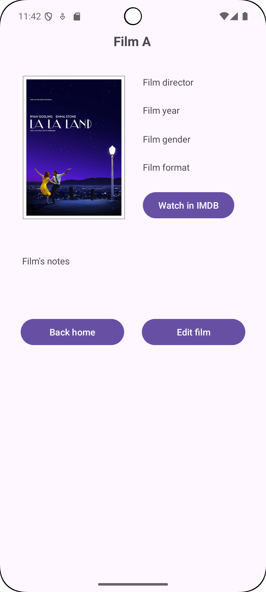

# Sesión 2 - Android Básico
## Entorno de desarrollo. Filmoteca

Para el desarrollo de esta práctica estoy utilizando Android Studio en los siguientes dispositivos:
* Un portátil, una torre y el Mac de clase.
  Lo aclaro, ya que los nombraré durante la práctica.

Las imágenes de este README están en la carpeta `img-readme` así como el [vídeo](img-readme/Demo-editada.mp4) demostración.

La práctica también se puede descargar en [GitHub](https://github.com/solsolet/Filmoteca.git).

### Ejercicio 1
Primero he cambiado todo lo que se llama "_main_" y lo he sustituido por "_about_", p. ej. "`MainActivity.kt` -> `AboutActivity.kt`". Dentro de este archivo, quité también el "ViewCompat".
Siguiendo con estos cambios también en el AndroidManifest he tenido cuidado que el archivo aparezca correctamente.

Por último, con el recurso `about_activity.xml` más de lo mismo.

### Ejercicio 2
Probarlo en el Mac ha sido sencillo, ha salido lo esperado.

Previamente, lo estaba probando con mi portátil y no me salía nada con el mismo código. Probé instalar HAXM pero no funcionó. Intenté también la conexión de mi móvil por USB con el portátil, y aunque la conexión funcionó, la ejecución de la aplicación no.

Sería cosa del portátil en sí, puede que tenga poca memoria para ejecutar la aplicación o me falte por descargar alguna cosa.

En casa, donde tengo una torre con un poco más de potencia, volví a probar y sí que fue. Como aclaración, el portátil y la torre tienen Linux, la distribución de Manjaro.
* Portátil: 8 GB de RAM.
* Torre: 16 GB de RAM.

### Ejercicio 3
Le he puesto los elementos comentados en el ejercicio, los he centrado con `constraitHorizontal` y los he espaciado. Los botones en `AboutActivity` los he nombrado como variables y luego les he añadido un _listener_ que al clicar muestre el _Toast_ de "_Funcionalidad sin implementar_".

Al probar la aplicación ha funcionado como se esperaba.

### Ejercicio 4
He seguido los pasos para la internacionalización. Al crear la nueva carpeta, `res/values-en`, veo que no se crea nada en Android Studio. Al preguntar el profe me comenta que es cosa de Mac: si creas una carpeta por defecto no aparece aunque esté.
La encuentro en el explorador y le añado un fichero para poder verla, en este caso una copia de `strings.xml`.

He usado la opción de Android Studio para traducir más cómodamente las _strings_, el editor de traducciones:


Como detalle, destacaré que he marcado el título de la aplicación para que no pueda traducirse.

### Ejercicio 5
Este ejercicio lo encontré más complicado al haber leído solo por encima el apartado del libro que lo explicaba. Al principio, me peleé poniendo el código del enunciado sin mucha idea ni criterio, además de no saber muy bien qué hacía. Consulté de nuevo con el profesor, lo cual me esclareció bastante las cosas, aunque aún necesitaba una lectura más calmada.

Terminé por entender el funcionamiento y la refactorización del código. Hasta ahora, estábamos usando _Layouts_, así que ese código lo encapsularía en un apartado destinado a ello, y el resto sería cosa de _Compose_.

_Compose_ por su parte, a pesar de haber leído la documentación y más o menos entenderlo, no paraba de darme errores. Al principio pensaba que era por culpa del código añadido en `AboutActivity.kt`, pero el problema lo tenía con **gradle**.

Una vez solucionado, con seguir un poco la guía del libro y la documentación de _Jetpack_ ya lo tenía.

#### Gradle
Mi primer error fue suponer que _gradle_ tendría todo lo necesario puesto y que yo no tenía que añadir nada. Después de leer de nuevo el apartado de los apuntes donde se explica un poco más, veo que falta alguna línea de código, aunque mi código sigue sin funcionar.

Además de los apuntes, el propio Android, conforme añadía librerías, me sugería otras y marcaba errores que podría consultar en la web [Compose Compiler Gradle plugin](https://developer.android.com/develop/ui/compose/compiler).

El resultado fue una mezcla de librerías que tenía el proyecto de por sí, unidas con las que me hacían falta para todos los elementos que usaban _Compose_. Se pueden ver en el archivo `build.gradle.kts` (:app).

Al ver que funcionaban, no podía evitar fijarme en los numerosos _warnings_ que aparecían en algunas. Leyendo un poco, vi que algunas librerías hacían lo mismo que otras, por tanto, existía duplicidad y no se llegaban  a usar, y por eso refactoricé un poco.

### Errores
1. Primer día - Error al descargar Device:
   

Pudo haber sido por falta de internet o del internet tan lento de la uni. Al cambiarme al Mac de clase con el SSD pude aprovechar el tiempo que quedaba para hacer la actividad en clase. En casa intenté descargarlo a ver si era cosa de la mala conexión.

2. Cargado lento del dispositivo de prueba

De los 3 dispositivos que estoy programando, en aquellos con poca potencia se han vuelto tediosas las pruebas, tanto que parecía que tenía un error en Android Studio cuando no era culpa suya.
Un error que ha saltado en el portátil "Se ha evitado una escasez de memoria..." seguido del cierre de la aplicación. Para nada recomendable.

3. No hacer caso de los _warnings_

He encontrado muy útil el apartado `Problems > Project Errors` que te destaca los errores y _warnings_ del proyecto.


Al curiosearla y ver _warnings_ no me había preocupado pero, revisando algunos con el profe, se me escapaban algunos como:
- no tener las librerías con la versión recomendada
- dejar cadenas de texto plano en lugar de su identificador `@string` en los elementos de la aplicación.

4. R.string.[algo] error _Compose_

Usar el identificador para cadenas de texto no funcionaba bien para los textos dentro de _Compose_. Se solucionó con la función `stringResource()`, que ciertamente no es muy intuitiva dado que en el resto del código lo puedes poner sin la función.

5. Falta de la imagen en el modo _Layout_

En las pruebas que he estado haciendo todos los elementos me salían bien, pero en las últimas en las que estoy preparando la entrega y haciendo pequeños cambios no estaba comprobando el _Layout_ y para mi sorpresa he visto que la imagen no cargaba.
Revisando el código estaba todo como antes, así que no sé si es por culpa de alguna librería o línea de código que he cambiado.

Por lo que he estado debuggeando y leyendo, parece ser que al dividir la aplicación según el modo, _Layout_ decide el recurso en tiempo de ejecución que al ver que no está declarada en `AboutActivity.kt` explícitamente (como en los ejercicios sin la partición) no lo encuentra y, por tanto, no lo pinta.
Esto también explica por que en _Compose_ sí que aparece por que usa `painterResource` que lo pinta.

El código para `initLayouts` ha quedado así:
```kt
// Log.d("AboutActivity", "initLayouts: layout about assignat")
val imageView = findViewById<ImageView>(R.id.imageView2)
// Log.d("AboutActivity", "imageView is null? ${imageView == null}")
// imageView?.visibility = View.VISIBLE
imageView?.setImageResource(R.drawable.monito)
```
Donde los `Log` han servido para trazar el problema con _Logcat_.

### Conclusiones
He aprendido mucho en esta práctica: todas las nociones de Gradle, consejos y pruebas creo que me dejan más preparada para la siguiente. Son bastantes conceptos nuevos y, con su uso, se me harán más intuitivos.

El tiempo que he tardado es el comprendido entre la clase del miércoles hasta el final de este viernes. Para ser la primera no sé si está bien o no, pero me tengo que dar un poco más de brío para que no se me acumule con las siguientes.

En cuanto a los **dispositivos** que he usado puedo clasificar su uso en:
|Dispositivo|Ventajas|Inconvenientes|
|-----------|--------|--------------|
|Portátil|Móvil: uso tanto en clase como en casa|Poca potencia, pantalla pequeña|
|Torre|Buen internet, 2 pantallas, potencia moderada|Solo puedo trabajar en casa|
|Mac|Buena pantalla, a veces va fluido|No estoy acostumbrada a Mac = lentitud, mal internet, a veces no va fluido|

La mejor opción para trabajar es la **torre**, así que intentaré hacer la mayor parte del trabajo en casa e intentaré que las pruebas en clase sean las menos posibles y me centre en dudas.

### Proyecto base
Después de que el profe subiese un proyecto base, he adaptado el mío para que se parezca lo máximo posible viendo poco a poco que decisiones de diseño ha tomado, modificar librerías y optimizar el código, sin olvidar por supuesto aprender. La parte que más ha cambiado es el modo _Layouts_ que ha pasado a ser _Bindings_ (y éste usa nuevas funciones para poner lo mismo).

## Navegación entre actividades
Siguiendo con la segunda práctica de la sesión, ahora nos centraremos en añadirle contenido a la práctica que ya teníamos.

### Ejercicio 1
Le añadimos funcionalidad a los botones como se nos indica. Me surge la siguiente inquietud: si estamos usando _Bindings_ y _Compose_ para hacer las mismas cosas, quiere decir que duplicaremos el mismo código constantemente si empezamos a añadir funcionalidad. Por tanto, todo aquello que es común (cada _intent_) lo saco en una función propia fuera de _initLayouts_ o _initCompose_:
```kt
private fun goWebsite(){
    val irWeb = Intent(Intent.ACTION_VIEW, "https://www.ua.es/va/".toUri())
    startActivity(irWeb)
}
private fun obtainSupport(){
    val soporte = Intent(Intent.ACTION_SENDTO, "mailto:gsl21@alu.ua.es".toUri())
    startActivity(soporte)
}
fun closeActivity(){ // No private por si la quisiéramos usar fuera
    finish()
}
```
Y luego en cada _init_ llamo a la función correspondiente:
|Binding|Compose|
|-------|-------|
|`bindings.button.setOnClickListener { goWebsite() }`|`Button(onClick = {  goWebsite() }) { Text(stringResource(R.string.button)) }`|
#### Ojito
En el modo _Compose_ he intentado quitar los corchetes del `onclick = {}` para dejar el método suelto, pero me ha dado error. Vista la ayuda de Android Studio veo lo siguiente:


Más adelante podría investigar sobre esto a ver si hay alguna otra manera de ponerlo y ver si es mejor.

### Ejercicio 2
Creamos las nuevas Actividades y cambiamos de aplicación principal:


Primero ponemos todos los elementos en cada actividad de manera que resultan así (aunque estén un poco feos):
|Pantalla|Compose|Binding|
|--------|-------|-------|
|FilmList|||
|FilmData|||
|FilmEdit|||
|About|||

Luego conectamos los botones con la pantalla correspondiente mediante **intents explícitos**, como por ejemplo:
```kt
private fun verPeli(){
    val verPeli = Intent(this@FilmListActivity, FilmDataActivity::class.java)
    startActivity(verPeli)
}
private fun acercaDe(){
    val acerca = Intent(this@FilmListActivity, AboutActivity::class.java)
    startActivity(acerca)
}
```
Veremos que está bien conectado con el vídeo de demo. Para finalizar el ejercicio nos hace falta poner _flags_ para que el botón de atrás pueda cerrar la aplicación:
```kt
private fun volverPrinc(){
    val volver = Intent(this@FilmDataActivity, FilmListActivity::class.java)
    volver.flags = Intent.FLAG_ACTIVITY_CLEAR_TOP
    startActivity(volver)
}
```
### Ejercicio 3
Empezamos por pasar primero un parámetro extra desde `FilmListActivity` a `FilmDataActivity` para ello añadimos el siguiente código a las dos clases:

#### FilmData
Primero declaramos el objeto "estático" para pasar el título como parámetro extra.
```kt
companion object {
    val EXTRA_FILM_TITLE = "EXTRA_FILM_TITLE"
}
```
Esta declaración permitirá llamar a `EXTRA_FILM_TITLE` desde cualquier parte del código. Después de declararla, realmente he seguido escribiendo el código en FilmList, pero para no marearnos dejo el código de cada parte en su apartado. Luego he usado la función `putExtra` para enviar de nuevo el titulo que habíamos enviado de `FilmList`:
```kt
private fun verPeliRel(titol: String){
    val verPeliRel = Intent(this@FilmDataActivity, FilmDataActivity::class.java)
    verPeliRel.putExtra(EXTRA_FILM_TITLE, titol)
    startActivity(verPeliRel)
}
```
Enviar de nuevo el título es para la parte final del enunciado, ya que lo pide.
Para mostrar el título correspondiente, según el Modo lo he declarado de la siguiente manera usando de variable `val peli = intent.getStringExtra(EXTRA_FILM_TITLE) ?: getString(R.string.tituloPeliDefecto)`
* Binding:
```kt
val peli = intent.getStringExtra(EXTRA_FILM_TITLE) ?: getString(R.string.tituloPeliDefecto)
bindings.textViewTituloPeli.text = peli
```
* Compose
```kt
@Composable
private fun ComposeFilmData() {
    val peli = intent.getStringExtra(EXTRA_FILM_TITLE) ?: getString(R.string.tituloPeliDefecto)
    Column( ...
    ) {
        Text(peli)
        ...
    }
}
```
#### FilmList
```kt
private fun verPeli(titol: String){
    val verPeli = Intent(this@FilmListActivity, FilmDataActivity::class.java)
    verPeli.putExtra(EXTRA_FILM_TITLE, titol)
    startActivity(verPeli)
}
```
En `initLayout()` pasamos el paràmetro al método de `verPeli` para que se lo pase a `FilmData`en el _intent_:
```kt
bindings.verPeliA.setOnClickListener { verPeli(getString(R.string.tituloPeliA)) }
```
#### Errores
Me he atascado bastantes veces por problemas con la conversión de 'peli' a texto que se pueda ver bien en la aplicación. Una vez implementé todo el código del parámetro extra al mostrarlo me salía en lugar del String correspondiente (o el de por defecto) un número, el ID que tomaba 'peli'.

A su vez tenía un _Warning_ en la cadena que quería mostrar `Peli: $peli` que tenía que ver con `setText` en el Modo _Binding_. No encontraba el motivo en `Film Data` y eso que no paraba de probar cualquier función relacionada con _Strings_ para ver si es que 'peli' realmente contenía un número. Al depurar con _Logcat_ para ver el contenido vi que seguía mostrando el mismo número. ¿Sería el _Warning_ u otra cosa?

He seguido buscando y buscando y el error estaba que antes en `FilmList` pasaba el parámetro de título así: `R.string.tituloDefecto.toString()`. Todo este tiempo, por ese mal paso de parámetro me daba el error. Aun me resulta confuso cuando usar una función de String y cuando no.

### Ejercicio 4
Parecido al ejercicio anterior, en este caso hemos editado la función `editPeli` de `FilmData` para pasar la información necesaria a `FilmEdit`, que este último a su vez, cuando termine su còdigo volverá a `FilmData`para terminar con el código que hemos sobrecargado en la función `onActivityResult`. De manera esquemática la lógica es: 

Y el código que lo ha hecho posible ha sido para `FilmData`:
```kt
val CODIGO_ACTIVIDAD_EDITAR = 1
private fun editPeli(){
    val edit = Intent(this@FilmDataActivity, FilmEditActivity::class.java)
    startActivityForResult(edit, CODIGO_ACTIVIDAD_EDITAR)
}
// called when secondary activity finishes
override fun onActivityResult(
    requestCode: Int,
    resultCode: Int,
    data: Intent?
) {
    super.onActivityResult(requestCode, resultCode, data)

    if (requestCode == CODIGO_ACTIVIDAD_EDITAR){
        if (resultCode == RESULT_OK){
            textEditado = " editado"
            when (Filmoteca.GlobalMode) {
                Mode.Bindings -> refreshTitleBinding()
                Mode.Compose -> refreshCompose()
            }
        }
    }
}
fun refreshTitleBinding(){
    val peli = intent.getStringExtra(EXTRA_FILM_TITLE) ?: getString(R.string.tituloPeliDefecto)
    bindings.textViewTituloPeli.text = peli + textEditado
}
private fun refreshCompose() {
    setContent {
        MaterialTheme {
            ComposeFilmData()
        }
    }
}
```
Y para `FilmEdit`:
```kt
private fun cerrar() {
    setResult(RESULT_CANCELED, null)
    finish()
}
private fun guardar() {
    val resultado = Intent()
    resultado.putExtra(EXTRA_FILM_TITLE, "editado")
    setResult(RESULT_OK, resultado)
    finish()
}
```

#### Errores
No se veía en la pantalla el "editado" al pulsar guardar en `FilmEdit` porque no había tenido en cuenta el orden en que se estaba llamando. Usaba `initLayout` para añadir una cadena de texto que cambiase a lo largo de la aplicación, pero `initLayout` solo se llama en `onCreate` al principio y nunca más entraba.

Viéndolo con el _debugger_, los valores estaban correctos, pero como no tenía ningún método que lo volviese a poner por pantalla nunca aparecía.

Por otra parte, en el Modo _Compose_ no he sabido como llamar únicamente al texto que contiene el título de la peli para añadirle el "editado", pero según he estado viendo en la documentación esto no es posible conforme yo me lo imaginaba. Haría falta llamar de nuevo a la función `ComposeFilmData`. Seguramente haya una manera más óptima de hacerlo, pero la iré descubriendo con la práctica.

### Ejercicio 5
Cualquier comentario sobre el Modo _Compose_ ya se ha hecho en los anteriores apartados. Podemos destacar que como la lógica la tengo separada en las funciones de cada botón, independientemente del Modo simplemente llamo a la misma función. Como particularidad podemos ver como he llamado a los botones de `FilmList` para ver como he pasado el título de la peli:
```kt
Button(onClick = { //TODO: mirar lo de Unit
    verPeli(titolPeliA)
}) {
    Text(stringResource(R.string.verPeliA))
}
```
### Resultado
En este apartado dejaré la comparativa entre el modo _Binding_ y _Compose_ para ver como ha quedado la funcionalidad implementada en todos los ejercicios. Los vídeos se encuentran en la carpeta `img-readme`:
|Bindings|Compose|
|--------|-------|
|||

## Vistas
### Ejercicio 1
He seguido las indicaciones y me ha quedado una pantalla así: 
|Con los `Constraints`|Resultado|
|---------------------|---------|
|||

Lo más complicado ha sido colocar los elementos de manera que si alguno se desplaza todos se desplacen correctamente y no se posicionen inesperadamente. P. ej.: _Los datos de la peli al lado del póster se han alineado a la izquerda y distribuido verticalmente_.

### Ejercicio 2
Para este tipo de _layout_ he usado la siguiente estructura:

Donde en las filas se puede apreciar que he empleado un `<LinearLayout  android:orientation="horizontal">`
|_BluePrint_|Resultado|
|---------------------|---------|
|||

También como apreciación he creado un nuevo documento _xml_ en `res/values` llamado [abrev.xml](app/src/main/res/values/abrev.xml) donde he puesto algunas variables que se repetían como `marginTop` de los elementos dispuestos en vertical o el tamaño de los `EditText` llamando a `@dimen`.
```xml
<EditText
    android:id="@+id/editTitulo"
    android:layout_width="@dimen/editEditItemWidth"
    android:layout_height="@dimen/editEditItemHeight"
    android:layout_gravity="center"
    android:layout_marginTop="@dimen/editMarginTop"
    android:autofillHints=""
    android:ems="10"
    android:hint="@string/tituloPeli"
    android:inputType="text" />
```

Otro archivo que he creado es [array.xml](app/src/main/res/values/array.xml) para los elementos de los `Spinner` que está parametrizado con `@strings` para la internacionalización.

Para terminar este ejercicio, destacar otras propiedades que he usado como:
* `layout_gravity`: para centrar los elementos.
* `autofillHints`: para sugerir un texto al usuario en el campo en el que estén.
* `hint`: para indicar qué campo se pide.
* `inputType`: para indicar si un campo necesita un imput especial como el año de la peli (en este caso `number`).
* `layout_weight`: para indicar el peso del elemento en los grupos horizontales.

### Ejercicio 3
He creado el archivo alternativo `activity_film_data.xml (land)` y se encuentra en la carpeta `activity_film_data` junto a su versión original en vertical.

Para hacerlo simplemente ha sido poner los mismos elementos y asignarles el mismo id que tienen en vertical.

El diseño me ha costado un poco decidirlo por que la disposición de los botones no quedaba bien en los diferentes sitios donde he probado. Podemos ver como ha resultado:
|_BluePrint_|Resultado|
|---------------------|---------|
|||

### Ejercicio 4
La transformación de las interfaces a _Compose_ ha consistido en buscar el elemento equivalente para este modo así como las disposiciones de `Row` o `Column`.
`FilmData` ha quedado así:
```kotlin
@Composable
private fun ComposeFilmData() {
    val context = LocalContext.current
    val peli = intent.getStringExtra(EXTRA_FILM_TITLE) ?: getString(R.string.tituloPeli)

    Column( //= LinearLayout(vertical)
        modifier = Modifier
            .fillMaxSize()      // separated, class notes' style
            .padding(horizontal = 24.dp, vertical = 16.dp),
        verticalArrangement = Arrangement.spacedBy(24.dp),
        horizontalAlignment = Alignment.CenterHorizontally
    ) {
        Text(
            text = peli + textEditado,
            fontSize = 22.sp,
            fontWeight = FontWeight.Bold,
            modifier = Modifier
                .padding(top = 50.dp)
        )
        Spacer(modifier = Modifier.height(8.dp))
        Row (
            modifier = Modifier.fillMaxWidth(),
            horizontalArrangement = Arrangement.spacedBy(16.dp),
            verticalAlignment = Alignment.Top
        ){
            Image(
                painter = painterResource(id = R.drawable.lalaland),
                contentDescription = stringResource(R.string.contentImage),
                modifier = Modifier
                    .width(165.dp)
                    .height(222.dp)
            )
            Column (
                verticalArrangement = Arrangement.spacedBy(30.dp),
                horizontalAlignment = Alignment.Start
            ){
                Text(stringResource(R.string.directorPeli)) //Director
                Text(stringResource(R.string.anyPeli)) //Year
                Text(stringResource(R.string.generoPeli)) //Genre
                Text(stringResource(R.string.formatoPeli)) //Format
            }
        }
        Button(onClick = {
            verPeliIMDB()
        }) {
            Text(stringResource(R.string.verIMDB))
        }

        Text(stringResource(R.string.notasPeli)) //Notes

        Row (
            modifier = Modifier
                .fillMaxWidth()
                .padding(top = 24.dp),
            horizontalArrangement = Arrangement.SpaceEvenly
        ){
            Button(onClick = {
                editPeli()
            }) {
                Text(stringResource(R.string.editPeli))
            }

            Button(onClick = {
                volverPrinc()
            }) {
                Text(stringResource(R.string.volverPrincipal))
            }
        }
    }
}
```
Y `FilmEdit` más de lo mismo. Destaco el "equivalente" al elemento _Spinner_ que he usado, `ExposedDropdownMenu` y todos sus relacionados:
```kotlin
//Spinner more or less
var genPeli = stringResource(R.string.generoPeli)
var generoExpanded by remember { mutableStateOf(false) }
var selectedGenero by remember { mutableStateOf(genPeli) }

val generos = listOf("Drama", "Comedia", "Acción", "Romance", "Sci-Fi") // you can load from R.array.generoPeli

ExposedDropdownMenuBox(
    expanded = generoExpanded,
    onExpandedChange = { generoExpanded = !generoExpanded }

) {
    TextField(
        value = selectedGenero,
        onValueChange = {},
        label = { Text(stringResource(R.string.generoPeli)) },
        readOnly = true,
        modifier = Modifier
            .fillMaxWidth()
            .menuAnchor(),
        trailingIcon = {
            ExposedDropdownMenuDefaults.TrailingIcon(expanded = formatoExpanded)
        }
    )
    ExposedDropdownMenu(
        expanded = generoExpanded,
        onDismissRequest = { generoExpanded = false }
    ) {
        generos.forEach { genero ->
            DropdownMenuItem(
                text = { Text(genero) },
                onClick = {
                    selectedGenero = genero
                    generoExpanded = false
                }
            )
        }
    }
}
```
En este ejemplo solo he mostrado el campo de `Género` de la película, pero `Formato` es igual con sus variables.

Antes de `ExposedDropdownMenu` había intentado usar el elemento `DropdownMenu`, pero como no me salía el resultado (no sé si por falta de otros elementos o alguna variable) he usado este que sí me ha dado el resultado que buscaba.
### Resultado
En este apartado dejaré la comparativa entre el modo _Binding_ y _Compose_ para ver como ha quedado la funcionalidad implementada en todos los ejercicios. Los vídeos se encuentran en la carpeta `img-readme`:
|Bindings|Compose|
|--------|-------|
|||

Como observación en el vídeo no se ve como funciona el botón de `ver in IMDB` ya que Android Studio daba error al guardar la grabación.

## Listas
Se puede ver el funcinamiento de las listas en el vídeo [Demo_P4](img-readme/Demo_P4.mp4)
### Ejercicio 1
He creado las clases pertinentes a este ejercicio:
- `Film`: que encapsula los datos de las películas.
- `FilmDataSource`: inicializa las pelis de prueba.
Y he modificado la clase `FilmListAvtivity` así como su layout. En esta le he añadido código a la función `initLayouts()` para ponerle el `ArrayAdapter` y que se mostraran las películas en la lista.
#### Errores
Al crear FilmDataSource no copié y pegué directamente el código que ponía el enunciado cosa que hizo que en lugar de escribir al principio `object`pusiese `class`. Esto provocó que en `FilmListActivity` no reconociese la propiedad `FilmDataSource.films`y me diese error en la compilación. Se resolvió al mirar y remirar el código poco a poco, pero es de estas tonterías que te vuelven loca por que no ves el fallo.

Otro fallo que me pasó fue a la hora de mostrar las diferentes películas en la lista. Me salía solamente la última añadida, así que lo más probable era que o no se estaban escribiendo bien las demás o se sobreescribían y por tanto solo persistía la última. Una vez más, fue por no fijarme a la hora de copiar y pegar, se me olvidó añadir la línea de `f = Film()`.
### Ejercicio 2
Continuando con los ejercicios, ahora me ha tocado crear nuevas clases o sobrecargas para mostrar los ítems en la lista más completos:
- `FilmsArrayAdapter.kt`: _adapter_ propio para mostrar más campos del ítem.
- `item_peli.xml`: aspecto del ítem en la lista (con imagen del poster y el nombre del director). Este _layout_ no tiene mucho misterio, he usado un `LineaLayout` horizontal para el ítem en general y para diponer el título y el director uno vertical.

`FilmsArrayAdapter`ha quedado de la siguiente manera:
```kotlin
class FilmsArrayAdapter(
    context: Context?, resource: Int,
    objects: List<Film>?
) : ArrayAdapter<Film>(context!!, resource, objects!!) {

    override fun getView(position: Int, convertView: View?, parent: ViewGroup): View {
        var view: View = convertView?: LayoutInflater.from(this.context)
            .inflate(R.layout.item_peli, parent, false)

        val peliTitulo   = view.findViewById(R.id.titulo) as TextView
        val peliDirector = view.findViewById(R.id.director) as TextView
        val peliImg      = view.findViewById(R.id.poster) as ImageView

        getItem(position)?.let {
            peliTitulo.text = it.title
            peliDirector.text = it.director
            peliImg.setImageResource(it.imageResId)
        }

        return view
    }
}
```

Como comentario sobre este ejercicio, he tenido un problema de entendimiento de la sobrecarga de la función `getView` al principio. Sin leer documentación ni nada, he intentado hacerla en lugar de con `View` con `Bindings` y claro, esto me ha acarreado mucho errores por que de por sí la función espera parámetros tipo _view_. Dejando la cabezonería a un lado, me he dado cuenta que mi idea estaba equivocada y que si hubiese alguna manera de conseguirlo, ahora no era el momento de ponerme a experimentar teniendo el resto de la práctica por hacer y lo he hecho con _view_ (y no complicarme la vida).

### Ejercicio 3
En `FilmListActivity` le he añadido el parámetro peli a la función `verPeli(position)` para saber que peli hemos pulsado y pasarsela a `FilmData`.
He adaptado `FilmDataActivity` para que al pulsar un elemento de `FilmListActivity` muestre la película adecuada y si se actualiza que se muestre bien:
```kotlin
fun refreshBinding(){
    val peliInt = intent.getIntExtra(EXTRA_FILM, 0)
    val peli = FilmDataSource.films[peliInt]

    val generos = resources.getStringArray(R.array.generoPeli)
    val formatos = resources.getStringArray(R.array.formatoPeli)

    bindings.textViewTituloPeli.text = peli.title
    bindings.textViewDirectorPeli?.text = peli.director
    bindings.textViewAnyPeli.text = peli.year.toString()
    bindings.textViewNotas.text = peli.comments
    bindings.textViewGeneroPeli.text = "${generos[peli.genre]}"
    bindings.textViewFormatoPeli.text = "${formatos[peli.format]}"
}

private fun initLayouts() {
    bindings = ActivityFilmDataBinding.inflate(layoutInflater)
    with(bindings) { //saves writing "binding." before
        setContentView(root)

        val peliInt = intent.getIntExtra(EXTRA_FILM, 0) //get ID
        val peli = FilmDataSource.films[peliInt]

        val generos = resources.getStringArray(R.array.generoPeli)
        val formatos = resources.getStringArray(R.array.formatoPeli)

        //Film data
        textViewTituloPeli.text = peli.title
        imageViewPeli.setImageResource(peli.imageResId)
        textViewDirectorPeli?.text = peli.director
        textViewAnyPeli.text = peli.year.toString()
        textViewGeneroPeli.text = "${generos[peli.genre]}"
        textViewFormatoPeli.text = "${formatos[peli.format]}"
        textViewNotas.append(": "+peli.comments)

        verPeliIMDB.setOnClickListener { verPeliIMDB(peli.imdbUrl) }
        editPeli.setOnClickListener { editPeli(peliInt) }
        volverPrincipal.setOnClickListener { volverPrinc() }
    }
}
```
Para guardar los datos editados en `FilmEditActivity`:
```kotlin
guardar.setOnClickListener {
    val titulo = editTitulo.text.toString().trim()
    val director = editDirector.text.toString().trim()
    val any = editAny.text.toString().trim()
    val comentarios = editNotas.text.toString().trim()

    // Solo actualizamos los campos que NO estén vacíos
    if (titulo.isNotEmpty()) peli.title = titulo
    if (director.isNotEmpty()) peli.director = director
    if (any.isNotEmpty()) peli.year = any.toIntOrNull() ?: peli.year
    if (comentarios.isNotEmpty()) peli.comments = comentarios

    // Devolvemos el resultado OK
    val res = Intent()
    res.putExtra(EXTRA_FILM, peliInt)
    setResult(RESULT_OK, res)
    finish()
}
``` 
#### Problemas
Me ha costado averiguar cual es laforma de saber cuando un `EditText` está vacío. Algunas de las pruebas las hice con _toast_ a ver si entraba en la condición:
```kotlin
if (TextUtils.isEmpty(editTitulo.getText())){
    Toast.makeText(this@FilmEditActivity, "You did not enter a username", Toast.LENGTH_SHORT).show();
} else {
    guardar(peliInt)
}
```
Algunas fueron y otras no.

Otro problema es que sabiendo como debía hacer el código no me hacía nada al guardar. En el momento que estoy haciendo esta actividad no entiendo el motivo pero si pongo el código que guarda la peli correctamente dentro del listener del botón 'Guardar' funciona perfectamente, pero si 'Guardar' llama a una fucnión con ese mismo código no funciona. Ha sido desesperante por que he probado muchas combinaciones, he usado el debugger y no caigo en que se me escapa. El resultado, como se ha visto anteriormente, es que ha ganado la practicidad al código limpio por falta de tiempo. En terminar la entrega si tengo tiempo corregiré detalls como estos de cara a las siguientes.

### Ejercicio 4


### Ejercicio 5

## Menús
Como observación para esta práctica, se llegó a implementar todo aquello que faltaba de la anterior para partir de esa base.
### Ejercicio 1
Para hacer esta actividad he creado el menú `film_list_menu` dentro de `res/menu`:
```kotlin
<?xml version="1.0" encoding="utf-8"?>
<menu xmlns:app="http://schemas.android.com/apk/res-auto"
    xmlns:android="http://schemas.android.com/apk/res/android">
    <item
        android:id="@+id/miNewFilm"
        android:icon="@android:drawable/ic_input_add"
        android:title="@string/anyadirPeli"
        app:showAsAction="always" />
    <item android:title="@string/acercaDe"
        android:id="@+id/miShowAbout"
        android:icon="@android:drawable/ic_dialog_info"
        app:showAsAction="ifRoom" />
</menu>
```
He usado los iconos por defecto que vienen en Android Studio, pero sería conveniente substituirlos en el futuro por algunos del mismo estilo ('añadirpeli' es feo y no pega con el otro).

Este menú se ha añadido gracias a que en el _layout_ `activity_film_list.xml` le he puesto un elemento _Toolbar_ y por código en `FilmListActivity` se ha usado `setSupportActionBar(findViewById(R.id.mtMenu))`.

La funcionalidad de los botones del menú la cubren a sobre carga de los métodos `onCreateOptionsMenu` y `onOptionsItemSelected` junto a las funciones `openAbout` y `newFilm`:
```kotlin
override fun onCreateOptionsMenu(menu: Menu): Boolean {
    super.onCreateOptionsMenu(menu)
    menuInflater.inflate(R.menu.film_list_menu, menu)
    return true
}
override fun onOptionsItemSelected(item: MenuItem): Boolean {
    super.onOptionsItemSelected(item)
    when (item.itemId) {
        R.id.miNewFilm -> {
            newFilm(adapt)
            return true
        }
        R.id.miShowAbout -> {
            openAbout()
            return true
        }
    }
    return false
}
private fun openAbout() {
    val openA = Intent(this@FilmListActivity, AboutActivity::class.java)
    startActivity(openA)
}
private fun newFilm(adapter: FilmsAdapter) {
    val f = Film()
    f.title = "<New film>"
    f.imageResId = R.mipmap.ic_launcher
    FilmDataSource.films.add(f)
    adapter.notifyItemInserted(FilmDataSource.films.size - 1)
}
``` 
Todo esto nos deja un _FilmList_ con este aspecto: 

### Ejercicio 2
En este ejercicio se ha implementado el menú de manera similar con la diferencia de no declarar nuestro propio xml, todas las funciones de _home_ se pueden declarar por defecto. Para ello he usado este código en cada actividad que necesitase el botón de _home_:
```kotlin
setSupportActionBar(findViewById(R.id.mtHomeMenu))
supportActionBar?.setDisplayHomeAsUpEnabled(true)
```
```kotlin
override fun onOptionsItemSelected(item: MenuItem): Boolean {
    val id: Int = item.itemId
    if (id == android.R.id.home) { // ID special for "home"
        NavUtils.navigateUpTo(this@FilmDataActivity,
            Intent(this@FilmDataActivity, FilmListActivity::class.java))
        return true
    }
    return super.onOptionsItemSelected(item)
}
```
#### Problemas
No estaba usando `supportActionBar` sino `actionBar` a secas y eso causaba que no fuese el botón a pesar de tenerlo todo bien. Con un par de búsquedas en la página oficial y ejemplos ha bastado para probarlo y darme cuenta.

Otro pequeño percance es que no tenía todas las clases heredando de _AppCompatActivity_ y por ello alguna daba error al principio, eso no me pasa por no seguir leyendo de los apuntes cuando encuentro la respuesta que busco.

### Ejercicio 3
Este ejercicio ha sido un poco lioso por que tenía la implementación con _RecyclerView_ y en los apuntes aparecía con _ListView_. He intentado implementarlo primero con _Recycler_, pero como no paraban de salirme problemas y errores al final me he decantado por lo "sencillo" que tiene _ListView_ de tener funciones que ayudan a los menús contextuales. De todos modos, con una implementación u otra, a fin de cuentas lo que iba a ser era similar:
1. Implementación de un modo u otro (_RecyclerView_/_ListView_).
2. Llamar a alguna función que habilite la selección múltiple, `selectMultipleFilm`.
3. Crear un menú contextual con botón para borrar.
4. Si el usuario pulsa ese botón con alguna película seleccionada, llama a una función de borrado, `deleteSelectedFilm`.

El código que he escrito y me ha funcionado es el siguiente:
```kotlin
private fun newFilm() {
    val f = Film()
    f.title = "<New film>"
    f.imageResId = R.mipmap.ic_launcher
    FilmDataSource.films.add(f)
    adaptador.notifyDataSetChanged()
}
private fun deleteSelectedFilm() {
    bindings.pelisList.let {
        val indices = it.checkedItemPositions
        val toDelete: MutableList<Film> = ArrayList()
        for (i in 0 until indices.size()) {
            if (indices.valueAt(i)) {
                toDelete.add(filmList[indices.keyAt(i)])
            }
        }
        filmList.removeAll(toDelete)
        adaptador.notifyDataSetChanged()
    }
    //bindings.pelisList.clearChoices()
}
private fun selectMultipleFilm(){
    bindings.pelisList.choiceMode = ListView.CHOICE_MODE_MULTIPLE_MODAL
    bindings.pelisList.setMultiChoiceModeListener(
        object : MultiChoiceModeListener {
            override fun onCreateActionMode( mode: ActionMode, menu: Menu
            ) : Boolean {
                val inflater = mode.menuInflater
                inflater.inflate(R.menu.film_list_contextual_menu, menu)
                return true
            }
            override fun onPrepareActionMode(mode: ActionMode, menu: Menu): Boolean {
                return false
            }
            override fun onActionItemClicked(mode: ActionMode, item: MenuItem): Boolean {
                return when (item.itemId) {
                    R.id.miDelete -> {
                        deleteSelectedFilm()
                        mode.finish()
                        true
                    }
                    else -> false
                }
            }
            override fun onDestroyActionMode(mode: ActionMode) {}
            override fun onItemCheckedStateChanged(
                mode: ActionMode, position: Int, id: Long, checked: Boolean) {
                val count = bindings.pelisList.checkedItemCount
                mode.title = "$count ${getString(R.string.multipleMenuCountSelected)}"
            }
        })
}
```
Y para refrescar como era `initLayouts()` en FilmList (teniendo en cuenta que 'adaptador' ha sido declarado al principio con `private lateinit var adaptador : FilmsArrayAdapter`):
```kotlin
    private fun initLayouts() {
        bindings = ActivityFilmListBinding.inflate(layoutInflater)

        with(bindings) {
            setContentView(root)
            setSupportActionBar(findViewById(R.id.mtMenu)) // Adds app bar
            // ListView
            adaptador = FilmsArrayAdapter(
                this@FilmListActivity,
                R.layout.item_peli, filmList
            )
            pelisList.setOnItemClickListener({ parent: AdapterView<*>, view: View, position: Int, id: Long ->
                verPeli(position) //Intent
            })
            pelisList.adapter = adaptador

            selectMultipleFilm()
        }
    }
```

#### Problemas
A parte de los ya mencionados con el tipo de implementación, me ha pasado también que al tener ya todas las funciones implementadas y a priori funcionales, al eliminar una o varias películas se cerraba la aplicación. No tenía ningún error de compilación así que en la ejecución estaba pasando algo raro. Después de mirar y remirar el código con el depurador, me doy cuenta que por intentar simplificarme la vida y sacar el adaptador como variable que pueda usar FilmList sin tener que pasarlo cada vez que llamo a una función, al haberlo declarado fuera e inicializarlo únicamente en `initLayout()` no me di cuenta que estaba mal inicializado. Le había puesto que debe ser un FilmsAdapter en lugar de un FilmsArrayAdapter, que son el adaptador de _RecyclerView_ y el de _ListView_ respectivamente. Con ese cambio de tipo se arregló todo.

### Demo
Podemos ver el funcionamiento de los menús y la barra contextual en la  en la carpeta `img-readme`.

## Fragment

### Demo
Podemos ver el funcionamiento de la implementación con fragments e la siguiente .
